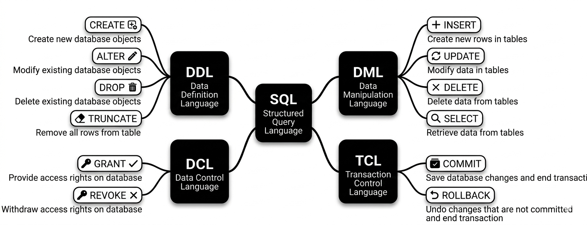

# SQL

## Installation

- Softwawre
  - Xammp --> for GUI --> biginner friendly
  - PostgrasSQL's pgAdmin
  - MySQL Workbunch

- Hierarchy of Relational Database Model
  1. Database Server
  2. DBMS
  3. Database
        - Tables
            - Rows
            - Coloumns

## What is SQL?

- SQL (pronounced "Sequel" or "S-Q-L") stands for Structured Query Language.
- It is the standard computer language used to talk to databases.
- Think of it as a universal translator that allows you to store, insert, change, and retrieve information kept inside a computer's digital filing cabinet.

- **How SQL Works (The Analogy)**
    Imagine a massive spreadsheet containing thousands of rows of customer data. Instead of scrolling through it manually, you write a short sentence in SQL to find exactly what you need.

- **The 4 Basic Things SQL Does**
  - Most database work involves four core actions, often abbreviated as CRUD
    - Create (INSERT): Adding new information to the database (e.g., creating a new user account).

    - Read (SELECT): Asking the database to find and show you specific information.

    - Update (UPDATE): Changing existing information (e.g., updating your delivery address).

    - Delete (DELETE): Removing information permanentely (e.g., closing a subscription account)

- **Why is SQL so important?**
  - **Everywhere:** It powers almost all major websites and apps, including Facebook, Netflix, and banking systems.
  - **Efficient:** It can filter through millions of rows of data in less than a second.
  - **Standardized:** Once you learn SQL, you can use it with almost any database software (like MySQL, PostgreSQL, or SQL Server).
  
## Types of SQL Commands

